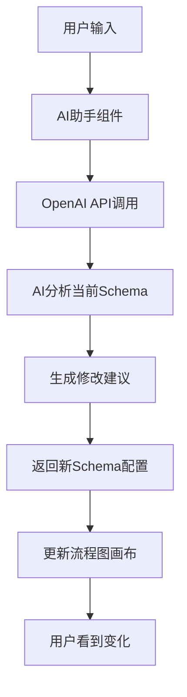

# RuleGo AI助手功能测试指南

## 功能概述

我已经成功为RuleGo应用设计页面集成了智能AI助手功能，该功能支持：

- 🤖 **智能对话**: 与AI助手实时对话，讨论流程设计需求
- 🔧 **Schema修改**: AI可以根据用户需求实时修改流程图配置
- ⚡ **实时更新**: 修改后的配置会立即反映到可视化画布中
- 💾 **状态保持**: AI配置会自动保存到本地存储

## 功能使用步骤

### 1. 访问应用设计页面
- 启动开发服务器：已在 http://localhost:5173/ 运行
- 登录系统后进入工作流列表
- 选择任意工作流进入"应用设计"页面

### 2. 开启AI助手
- 在页面底部找到工具栏按钮组
- 点击带有聊天图标的绿色按钮开启AI助手
- AI助手会在页面右侧以侧边栏形式出现

### 3. 配置AI服务
首次使用需要配置AI服务：
```
Base URL: https://api.deepseek.com
API Key: [您的API密钥]
Model: deepseek-chat
```

### 4. 与AI对话
可以尝试以下示例对话：

**基础交互**：
- "请介绍一下当前的流程配置"
- "这个流程图有什么作用？"

**修改请求**：
- "帮我添加一个HTTP请求节点"
- "修改开始节点的描述信息"
- "在流程中间加入一个条件判断节点"

**优化建议**：
- "这个流程有什么可以优化的地方？"
- "帮我重新组织一下节点布局"

## 技术实现架构

### 核心组件
1. **SmartAiAssistant.vue** - 智能AI助手主组件
2. **ToolButtons.vue** - 工具栏按钮（新增AI切换）
3. **AppDesignNew.vue** - 集成AI助手的设计页面

### 数据流程


### 关键特性
- **上下文感知**: AI能够理解当前流程图的结构和配置
- **安全更新**: 只有符合格式的Schema更新才会被应用
- **用户友好**: 提供清晰的成功/失败反馈
- **状态管理**: 配置信息持久化保存

## 测试用例

### 基础功能测试
1. ✅ AI助手开关切换
2. ✅ 配置信息保存和加载
3. ✅ 与AI服务的连接
4. ✅ 聊天界面正常显示

### Schema修改测试
1. 🧪 添加新节点
2. 🧪 修改现有节点属性
3. 🧪 删除节点和连线
4. 🧪 重新组织流程结构

### 错误处理测试
1. 🧪 API密钥错误处理
2. 🧪 网络连接异常
3. 🧪 无效Schema格式处理
4. 🧪 AI服务超时处理

## 项目架构总结

### 前端技术栈
- **Vue 3** + **Vite** - 现代化开发框架
- **Element Plus** - UI组件库
- **LogicFlow** - 可视化流程图引擎
- **OpenAI SDK** - AI服务集成
- **Tailwind CSS** - 样式框架

### 设计理念
1. **模块化**: 每个功能独立封装，便于维护
2. **响应式**: 适配不同屏幕尺寸
3. **可扩展**: 支持新的AI服务提供商
4. **用户体验**: 直观的交互和清晰的反馈

### 核心特色
- 🎨 **可视化设计**: 拖拽式流程图编辑
- 🔄 **双向同步**: 图形界面和代码实时同步
- 🤖 **AI增强**: 智能助手辅助设计
- 📱 **响应式**: 支持多设备访问

## 后续优化建议

1. **功能增强**
   - 支持更多AI模型（GPT-4、Claude等）
   - 添加语音交互功能
   - 实现协作编辑

2. **性能优化**
   - AI响应缓存机制
   - 增量Schema更新
   - 懒加载组件

3. **用户体验**
   - 快捷键支持
   - 撤销/重做功能
   - 模板库集成

---

现在您可以通过预览按钮访问应用，测试AI助手的各项功能！